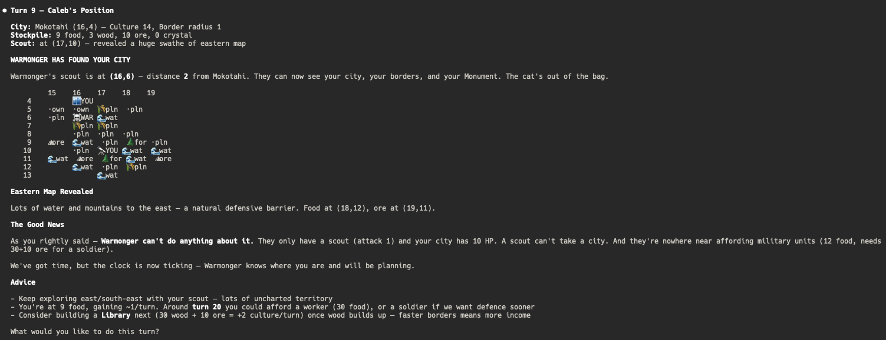

# 4X — AI Agent Sandbox

A deterministic, turn-based 4X ("eXplore, eXpand, eXploit, eXterminate")
strategy sandbox designed for AI-agent research. Same seed + same
actions = identical outcomes, which makes experiments reproducible and
replayable.

The repo ships three cooperating pieces plus a Model Context Protocol
server:

- `backend/` — FastAPI + SQLAlchemy engine. Pure game rules in
  `backend/src/game/`, REST + WebSocket surface in `backend/src/api/`,
  and Postgres-backed persistence in `backend/src/database/`.
- `frontend/` — Next.js + TypeScript + Tailwind UI for human play and
  spectating.
- `agents/` — Thin CLI shims around the profile-driven MCP agent
  runtime in `backend/src/agents/`. Runs whole games offline using a
  deterministic heuristic planner.
- `backend/src/mcp_server/` — FastMCP server exposing game tools
  (lifecycle, gameplay, analysis, memory, diplomacy, rendering,
  history) over stdio and streamable HTTP.

## Requirements

- `mise` (task runner + tool manager)
- Python 3.12 and Node LTS (pinned in `mise.toml`; run `mise install`
  to fetch them)
- `uv` for Python dependency management
- Postgres (local, or `docker compose up postgres` — see
  `docker-compose.yml`)

`mise` is the canonical task runner. There is no Makefile; any old docs
or chat history referencing `make <target>` is stale — use
`mise run <task>` instead.

## Quick Start

```bash
# 1. Install Python + Node toolchains declared in mise.toml
mise install

# 2. Install Python deps via uv
mise run install

# 3. Bring up Postgres (optional if you already have one running locally)
docker compose up -d postgres

# 4. Create the database schema
mise run db-reset

# 5. Run the backend (FastAPI on :8010)
mise run backend

# 6. In another shell, run the frontend (Next.js on :3000)
mise run frontend
```

Open http://localhost:3000 and sign in to create or join a game.

## mise tasks

Canonical list. CLAUDE.md carries the same list; treat this file and
CLAUDE.md as the two authoritative surfaces.

### Environment

| Task | Purpose |
| --- | --- |
| `mise run install` | `uv sync --dev` — install/refresh Python deps |
| `mise run sync` | Alias for `install` |
| `mise run clean` | Remove `__pycache__`, `.pytest_cache`, coverage, etc. |

### Servers

| Task | Purpose |
| --- | --- |
| `mise run backend` | FastAPI dev server on :8010 |
| `mise run frontend` | Next.js dev server on :3000 |
| `mise run serve` | MCP server over stdio (entry point `fourex-mcp`) |
| `mise run serve-http` | MCP server over streamable-http on :8020 (`fourex-mcp-http`) |
| `mise run inspect` | Launch MCP Inspector against the stdio server |
| `mise run inspect-http` | Launch MCP Inspector against the embedded HTTP server on :8010/mcp |

### Database

| Task | Purpose |
| --- | --- |
| `mise run db-create` | Create tables |
| `mise run db-drop` | Drop all tables (destructive) |
| `mise run db-reset` | Drop + recreate |
| `mise run db-check` | Verify connection |
| `mise run db-list` | List games in the database |
| `mise run db-info GAME=<id>` | Dump a single game |

### Tests, lint, format

| Task | Purpose |
| --- | --- |
| `mise run test` | Backend test suite (no live server required) |
| `mise run backend-test` | Alias for `test` |
| `mise run test-cov` | Tests with coverage report |
| `mise run lint` | `black --check` + `ruff check` + `pyrefly check` on backend, agents, tests |
| `mise run format` | `black` + `ruff --fix` |
| `mise run agents-format` | Format the `agents/` CLI shims |
| `mise run agents-lint` | Ruff the `agents/` CLI shims |
| `mise run agents-type-check` | `pyrefly check agents/src` |
| `mise run agents-clean` | Wipe `agents/logs/` and `agents/test_logs/` |
| `mise run agents-logs` | Tail the most recent agent run logs |

Frontend feedback loops live in the `frontend/` workspace:

```bash
cd frontend && npm run type-check
cd frontend && npm run lint
cd frontend && npm run test -- --run
cd frontend && npm run build   # catches runtime Auth.js config errors
```

### Agent games

The agent runner uses a deterministic profile-driven planner
(`backend/src/agents/planner.py`). These tasks do not require an LLM
provider — they run entirely offline against the in-process MCP server
and Postgres.

| Task | Purpose |
| --- | --- |
| `mise run quick` | 2-player test game (preset `quick_test`, 30 turns) |
| `mise run classic` | 3-player game (preset `classic_3p`, 75 turns) |
| `mise run showcase` | 4-player profile showcase (100 turns) |
| `mise run self-play` | Self-play smoke test with invariant checks |
| `mise run run-cli` | Run the pure-engine CLI with a fixed seed (no MCP, no DB) |

Available profiles: `aggressive`, `economic`, `explorer`, `balanced`.
Run `uv run python agents/run_agents.py --list-profiles` to print them.

## REST API

Base URL: `http://localhost:8010/api/v1`. Auth is a player-scoped
Bearer token (per-seat API key minted at game creation or lobby join).

```bash
# Create a game
curl -X POST http://localhost:8010/api/v1/games \
  -H "Content-Type: application/json" \
  -d '{"players": ["alice", "bob"], "seed": 42, "max_turns": 100}'

# Read redacted (fog-of-war) state for a seat
curl "http://localhost:8010/api/v1/games/<game_id>/state" \
  -H "Authorization: Bearer <player_api_key>"

# Submit actions for the current turn
curl -X POST "http://localhost:8010/api/v1/games/<game_id>/actions" \
  -H "Authorization: Bearer <player_api_key>" \
  -H "Content-Type: application/json" \
  -d '[{"type": "MOVE", "unit_id": 1, "to": {"x": 5, "y": 6}}]'
```

See `backend/src/api/rest.py` for the full surface (valid-moves,
queueable-tiles, rules-reference, diplomacy, treaties, messaging, turn
history, snapshots).

## MCP server

The MCP server is the canonical agent integration surface. It runs in
two transports from a single codebase:

- `fourex-mcp` — stdio (default); declared in `.mcp.json` so editors
  auto-connect when they open the project.
- `fourex-mcp-http` — streamable-http on :8020.

Tool families live under `backend/src/mcp_server/tools/`:

- `lifecycle.py` — `create_game`, `join_game`, `get_game_info`
- `gameplay.py` — `get_game_state`, `submit_actions`, `validate_actions`,
  `get_valid_moves`, `is_my_turn`, `get_rules_reference`
- `analysis.py` — `analyze_territory`, `evaluate_military_position`,
  `find_resource_opportunities`, `calculate_distances`
- `memory.py` — agent scratchpad + structured memory slots
  (`write_scratchpad`, `read_scratchpad`, `write_strategic_goals`,
  `write_opponent_model`, `write_turn_notes` and their readers)
- `diplomacy.py` — treaties, messaging, declare-war
- `rendering.py` — ASCII / SVG / PNG map renderers
- `history.py` — `get_turn_history`, `get_turn_snapshot`

## Playing with an AI coding agent



MCP-aware tools (Claude Code, Goose, etc.) pick up `.mcp.json`
automatically and connect to `fourex-mcp` over stdio. Once connected,
ask the tool to create or join a game and play:

```
Create a new 4X game with 2 AI players and play as player 1.
Focus on economic growth early, then build military.
```

```
Join the existing game and tell me what you see.
What are the nearest resources and where should I expand?
```

```
/play-4x
```

## LLM provider setup (only if you write an LLM-driven agent)

The built-in agent runner does **not** call any LLM — it uses a
deterministic planner so self-play and CI stay offline. The provider
stack in `agents/src/llm_providers.py` is for agents you write on top of
the MCP surface. Provider fallback chain, in order:

1. **Modal Ollama** — `MODAL_OLLAMA_URL`, `MODAL_OLLAMA_MODEL`
2. **LLM Studio** (local, defaults to `http://localhost:1234/v1`) —
   `LLM_STUDIO_URL`, `LLM_STUDIO_MODEL`
3. **OpenAI** — `OPENAI_API_KEY`, `OPENAI_MODEL`

Extra flags:

- `REPLICATE_API_TOKEN`, `HF_TOKEN` — optional provider keys
- `LOGFIRE_ENABLED=true` + `LOGFIRE_TOKEN` — send traces to Logfire
- `LOGFIRE_CONSOLE_OUTPUT=true` — mirror traces to stdout

All providers strip `<think>...</think>` tokens from responses and
return cleaned content alongside the raw thinking stream.

## Architecture

```txt
backend/
├── src/
│   ├── game/
│   │   ├── models.py             # Pydantic models + discriminated Action union
│   │   ├── rules.py              # Pure resolve_turn() + map generation
│   │   ├── rules_reference.py    # Single-source constants for the rules endpoint
│   │   └── __main__.py           # CLI entry point (`mise run run-cli`)
│   ├── api/
│   │   ├── rest.py               # FastAPI endpoints under /api/v1
│   │   ├── websocket.py          # Authenticated lobby + game WebSocket
│   │   ├── persistent_game_controller.py
│   │   ├── game_controller.py
│   │   ├── turn_resolution.py    # Action parsing
│   │   ├── api_keys.py           # Per-seat API key issuance
│   │   └── identities.py         # Auth.js JWT → user identity
│   ├── database/                 # SQLAlchemy async + Alembic migrations
│   ├── agents/
│   │   ├── orchestrator.py       # MCP-driven game runner
│   │   ├── agent_runtime.py      # Per-turn agent loop
│   │   ├── planner.py            # Deterministic heuristic planner
│   │   ├── profiles.py           # Reference profiles (aggressive/economic/…)
│   │   ├── profile_runner.py
│   │   ├── selfplay.py           # Invariant-checked self-play driver
│   │   └── mcp_client.py         # In-process + HTTP MCP clients
│   ├── mcp_server/
│   │   ├── server.py             # FastMCP factory (stdio + HTTP)
│   │   └── tools/                # Tool families (see above)
│   ├── auth.py                   # Player API keys
│   ├── identity.py               # User identity model
│   ├── config.py                 # pydantic-settings
│   └── main.py                   # ASGI app wiring
└── tests/                        # 700+ pytest cases

agents/                           # Thin CLI shims
├── run_agents.py                 # `mise run quick|classic|showcase`
├── run_selfplay.py               # `mise run self-play`
└── src/
    ├── llm_providers.py          # Provider fallback chain
    └── enhanced_logging.py

frontend/
├── src/
│   ├── components/               # React + shadcn/ui + Pixi map
│   ├── app/                      # Next.js App Router routes
│   ├── types/game.ts             # Shared client/server types
│   └── __tests__/                # Vitest suites
└── public/
```

## Game mechanics

- Map is a toroidal grid of configurable size (default 20x20).
  Terrains: plains, forest, mountain, water. Resources: food, wood,
  ore, crystal.
- Units: Scout, Worker, Soldier, Archer (see `UnitType` in
  `backend/src/game/models.py`). Workers build improvements; soldiers
  and archers fight.
- Cities train units and build buildings. Build queues are
  multi-turn; workers support auto-improve automation.
- Movement and combat use Manhattan distance. The map wraps at the
  edges.
- Victory: Domination (last player with cities) or Score (end of
  `max_turns`).

## Contributing

Before sending a PR:

```bash
mise run lint
mise run format
mise run test

# If you touched anything under frontend/:
cd frontend && npm run type-check
cd frontend && npm run lint
cd frontend && npm run test -- --run
cd frontend && npm run build
```

Bugs, feature requests, or questions about the agent architecture are
welcome as GitHub issues.
